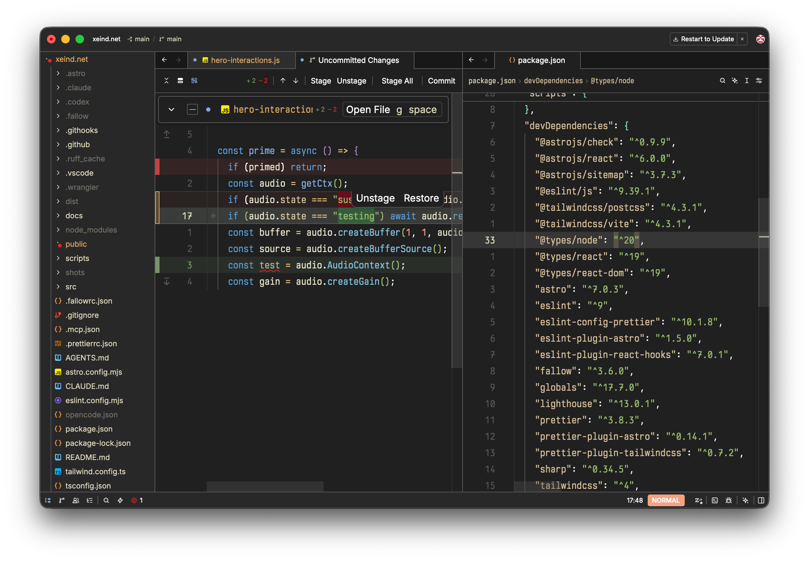

<h1>
  
  Nightingale
</h1>

Ported from [nightingale.nvim](https://github.com/xeind/nightingale.nvim).

## Install

Open Zed → Extensions (`Cmd+Shift+X`) → search **Nightingale** → Install.

## Use

Command Palette (`Cmd+Shift+P`) → `theme selector: toggle` → **Nightingale**.

## License

MIT
